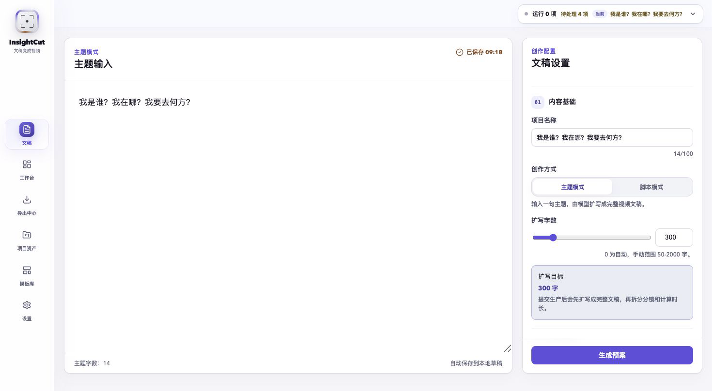
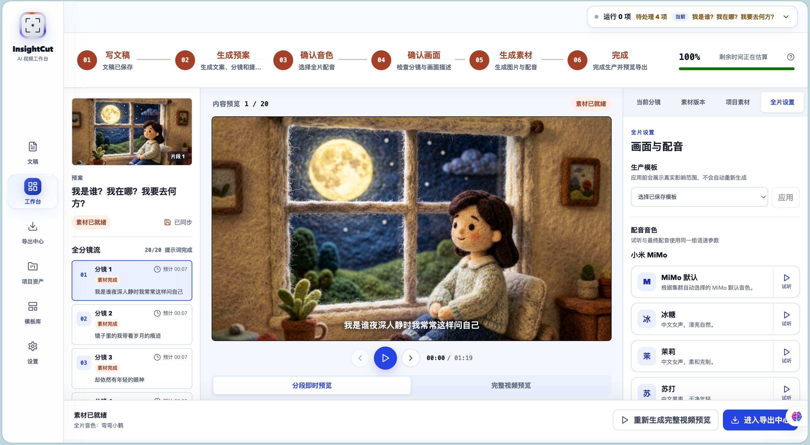
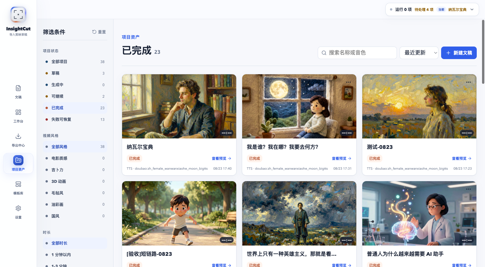

  <picture>
    <source media="(prefers-color-scheme: dark)" srcset="docs/assets/insightcut-mark-dark.svg" />
    <source media="(prefers-color-scheme: light)" srcset="docs/assets/insightcut-mark.svg" />
    
  </picture>
  <h1>InsightCut</h1>
  
<strong>A local-first, editable, and recoverable AI image-video workspace</strong>

  
Turn a topic or complete manuscript into storyboards, visuals, voiceovers, subtitles, previews, and editable Jianying / CapCut drafts.

  

    <a href="README.md">简体中文</a> · English
  

  

    
    
    
    
    
    
  

  

    <a href="https://skynotsilent.github.io/insightcut-jianying-image-video/showcase/"><strong>Showcase</strong></a>
    · <a href="#quick-start"><strong>Quick Start</strong></a>
    · <a href="#start-from-one-line"><strong>Product Tour</strong></a>
    · <a href="docs/"><strong>Documentation</strong></a>
    · <a href="https://github.com/SkyNotSilent/insightcut-jianying-image-video/issues"><strong>Issues</strong></a>
  

---

InsightCut is built for explainers, educational videos, knowledge content, opinion pieces, and short-form production. It is not a one-shot page that returns a single MP4. Each project keeps its manuscript, storyboard, image prompts, images, voiceovers, subtitles, and export history available for further editing.

<table>
  <tr>
    <td width="33%"><strong>Editable after generation</strong> Revise one segment, prompt, image, or voiceover without restarting the entire workflow.</td>
    <td width="33%"><strong>Resume after failure</strong> Completed assets remain available, and recovery retries only missing or failed targets.</td>
    <td width="33%"><strong>Deliver video and project files</strong> Export MP4, per-segment assets, and editable Jianying / CapCut drafts.</td>
  </tr>
</table>

> The database, media files, configuration, and voice-clone references stay on your machine by default. InsightCut is not affiliated with Jianying, CapCut, ByteDance, or their subsidiaries.

## Start from one line

Start from a short topic or paste a complete manuscript. Confirm the project name, aspect ratio, visual style, and writing style before generation. Topic mode expands the input into a full manuscript for review, while script mode preserves the supplied text.

## Real output

Every example below was produced from a real local InsightCut task. The underlying manuscript, segments, prompts, images, voiceovers, subtitles, and export records remain editable after completion.

<a href="https://skynotsilent.github.io/insightcut-jianying-image-video/showcase/"><strong>Open the complete video showcase →</strong></a>

### Who Am I? Where Am I? Where Am I Going?

**Topic mode** · Original input: `我是谁？我在哪？我要去何方？`

**Warm, reflective writing** · **Felt art** · 16:9 · 20 segments · 01:09

InsightCut expanded those 14 Chinese characters into the manuscript, storyboard, prompts, images, voiceover, subtitles, and final video. No extra script was written for the showcase.

[▶ Play it in the online showcase](https://skynotsilent.github.io/insightcut-jianying-image-video/showcase/#who-am-i-16x9)

### Island Economics

**Script mode** · Input: a complete educational manuscript

**Educational writing** · **Felt art** · 16:9 · 01:02

https://github.com/user-attachments/assets/34833f83-5416-41b9-9a75-b47ddd0e5f05

### Thirty Years East, Thirty Years West

**Topic mode** · Original input: `30 年河东，30 年河西，莫欺少年穷`

**Educational writing** · **Ghibli-inspired** · 16:9 · 18 segments · 00:44

https://github.com/user-attachments/assets/989b52b5-2f3e-4ed6-9a36-6c26fd02f606

### Growth Is the Best Remedy

**Script mode** · Input: a complete motivational manuscript

**Motivational writing** · **Cinematic** · 16:9 · 01:03

https://github.com/user-attachments/assets/de662301-8653-43bf-bf54-31a6d7d2dba1

### Why Busy Adults Need Deliberate Empty Space

**Script mode** · Input: a complete educational manuscript

**Educational writing** · **Cinematic** · 9:16 · 00:55

https://github.com/user-attachments/assets/7d7b050e-25c2-4f4f-8cf5-1ab3f7157a95

### Do Not Mistake Busyness for Growth

**Script mode** · Input: a complete spoken-word manuscript

**Conversational writing** · **Chinese illustration** · 3:4 · 00:52

https://github.com/user-attachments/assets/e4695fbc-2339-4102-b631-bcf61df63264

## Production and project surfaces

### Production workspace

The spatial workspace keeps all six production stages visible. Browse segments on the left, preview the current scene in the center, and manage segment settings, immutable asset versions, project media, and full-video settings on the right.

Regeneration and uploads append new versions instead of overwriting old files. Existing versions can be reviewed, played, and restored without another model call.

### Project library

The project library brings together drafts, running jobs, resumable projects, completed work, and recoverable failures. Filter by status, visual style, or duration, then return directly to preview, recovery, or export.

## How the workflow fits together

~~~text
Topic / complete manuscript
  → manuscript preparation
  → storyboard and image prompts
  → voice and visual confirmation
  → AI images and TTS
  → subtitles and continuous preview
  → MP4 / asset package / Jianying or CapCut draft
~~~

Unlike a typical one-click generator, InsightCut treats each run as a project that can continue evolving. A single image can be regenerated, one voiceover can be replaced, and a failed generation can resume from the assets that already succeeded.

## Highlights

1. Generate a manuscript from a topic or preserve an existing script in manuscript mode.
2. Select aspect ratio, visual style, writing style, and project name before starting.
3. Review the full manuscript, short storyboard segments, image prompts, expected duration, and voice choice before spending image-generation quota.
4. Generate images and TTS voiceovers per segment with precise progress and actionable error states.
5. Retry only failed images or audio while retaining everything that already completed.
6. Keep immutable image and audio histories, upload replacements, and reuse project assets.
7. Preview the project continuously before deciding whether to render a complete MP4.
8. Export a complete video, a per-segment asset package, or an editable Jianying / CapCut draft.
9. Save production templates for visuals, voice, subtitles, concurrency, and retry policy.
10. Configure LiteLLM text providers, Agnes image generation, Doubao TTS, Xiaomi MiMo TTS, and local voice clones.

## Quick start

### Requirements

- Python 3.9
- Node.js and npm
- FFmpeg; the installed <code>imageio-ffmpeg</code> package can provide a bundled binary

### 1. Clone

~~~bash
git clone https://github.com/SkyNotSilent/insightcut-jianying-image-video.git
cd insightcut-jianying-image-video
~~~

### 2. Install the backend

~~~bash
cd ai-kepu-video-server
python3 -m venv venv
source venv/bin/activate
pip install -r requirements.txt
cp .env.example .env
~~~

### 3. Install the frontend

~~~bash
cd ../ai-kepu-video-web/frontend
npm install
~~~

### 4. Start the backend

Run inside <code>ai-kepu-video-server/</code>:

~~~bash
source venv/bin/activate
python -m uvicorn api_server:app --host 0.0.0.0 --port 2002 --reload
~~~

- Backend: <http://localhost:2002>
- API docs: <http://localhost:2002/docs>
- Health check: <http://localhost:2002/health>

### 5. Start the frontend

Run in another terminal inside <code>ai-kepu-video-web/frontend/</code>:

~~~bash
npm run dev
~~~

Open <http://localhost:2001>. The frontend connects to <code>http://localhost:2002</code> by default; set <code>VITE_API_BASE_URL</code> to override it.

### 6. Configure providers

Open <http://localhost:2001/settings>:

1. Select a LiteLLM text provider and model, then enter the required credentials.
2. Optionally validate the connection and synchronize models available to the account.
3. Enter the Agnes image API key and verify the requested image size.
4. Enable Doubao TTS, MiMo TTS, or both, and select the default provider for new tasks.
5. Enable and preview voices. For MiMo voice cloning, confirm authorization and upload or record a reference.
6. Save the configuration and return to the manuscript page.

Credentials remain in local configuration. Never commit <code>.env</code>, <code>data/config.json</code>, API keys, access tokens, or screenshots containing secrets.

## Model and media providers

### Text generation

LiteLLM manages known text providers with canonical model IDs and keeps OpenAI-compatible and Anthropic-compatible custom endpoints available under advanced settings.

### Image generation

- API: OpenAI-compatible <code>images/generations</code>
- Model: <code>agnes-image-2.1-flash</code>
- Default concurrency: 8
- Built-in rolling 20-requests-per-minute throttle and HTTP 429 retry handling

### Voice

- **Doubao TTS:** Access Token and API Key authentication, preset voices, speed, and volume.
- **Xiaomi MiMo TTS:** preset voices, style instructions, speed, and local VoiceClone references.
- Tasks and segments snapshot their provider, voice, and options so later global settings do not silently change old projects.

## Jianying / CapCut delivery

The editable draft and the MP4 are separate deliverables. Writing a draft does not re-import the rendered MP4 or call a model again. InsightCut installs the current images, voiceovers, subtitles, and timeline into the selected draft directory.

1. Open Export Center after a task is complete.
2. Select the Mac or Windows draft format.
3. Choose the Jianying / CapCut draft root. A common macOS location is <code>/Users/your-name/Movies/JianyingPro/User Data/Projects/com.lveditor.draft</code>.
4. Write the project. The backend creates an isolated folder, copies assets and draft JSON, and rewrites paths for the target OS.
5. Fully restart the editor if the new draft does not appear immediately.

When downloading a draft ZIP, extract it into its own project folder under the draft root. Importing the ZIP as ordinary media will not create an editable project.

## Failure recovery

A <code>failed</code> task means the remaining pipeline stopped; it does not mean completed content was deleted. InsightCut preserves the current manuscript, storyboard, prompts, images, audio, and draft whenever possible.

From that state you can:

- inspect errors by provider, asset type, and segment;
- retry all failed assets or one exact image or voiceover;
- edit segment text or image prompts;
- upload a replacement or restore an earlier version;
- resume from a recovery point; or
- continue editing and exporting the assets that already completed.

## Outputs

- MP4 with images, voiceover, subtitles, and basic motion.
- Editable Jianying / CapCut draft ZIP.
- Per-segment text, image prompts, and project records.
- Immutable image and audio generation, retry, upload, replacement, and reuse history.
- TTS audio and SRT subtitles.
- Local records used for recovery, re-voicing, and regeneration.

## Technology

| Layer | Stack |
| --- | --- |
| Frontend | React 19, React Router 7, Vite 4, Axios, Lucide |
| Backend | FastAPI, Python 3.9 |
| Database | Local SQLite |
| Text | LiteLLM Provider Registry, OpenAI / Anthropic compatibility |
| Image | Agnes Image 2.1 Flash, OpenAI-compatible Images API |
| Voice | Doubao TTS, Xiaomi MiMo TTS, MiMo VoiceClone |
| Video | FFmpeg, imageio-ffmpeg |
| Drafts | pyJianYingDraft |
| Storage | Local <code>data/media/</code> and <code>output/</code> |

## Repository layout

~~~text
insightcut-jianying-image-video/
├── ai-kepu-video-server/          # FastAPI backend
│   ├── api_server.py              # Web API entry point
│   ├── src/                       # generation, tasks, media, and export logic
│   ├── data/                      # local database, media, and config (untracked)
│   └── output/                    # new generated tasks (untracked)
├── ai-kepu-video-web/frontend/    # React 19 + Vite frontend
├── docs/
│   ├── assets/                    # README brand assets
│   ├── screenshots/               # current product screenshots
│   ├── showcase/                  # playable videos from real projects
│   └── prd/                       # approved product requirements
└── scripts/                       # repository checks and maintenance tools
~~~

## Tests and builds

Backend:

~~~bash
cd ai-kepu-video-server
source venv/bin/activate
python -m pytest -q
~~~

Frontend:

~~~bash
cd ai-kepu-video-web/frontend
npm test
npm run test:components
npm run build
~~~

For a read-only local maintenance report:

~~~bash
cd ai-kepu-video-server
python scripts/maintenance_report.py --dry-run
~~~

Only an explicit <code>--apply</code> removes media files that are no longer referenced by the database.

## Local data and security

Do not commit:

- <code>.env</code>, API keys, access tokens, and App IDs;
- <code>ai-kepu-video-server/data/local.db</code>;
- <code>data/media/</code>, <code>output/</code>, and generation logs;
- MiMo voice-clone references and previews; or
- screenshots containing credentials, account details, or local absolute paths.

Media is served through <code>/media/{file_path}</code>, searching <code>output/</code> first and <code>data/media/</code> second. The current project uses local SQLite and local files only.

## More documentation

- [On-demand preview and final-video export PRD](docs/prd/2026-08-16-on-demand-video-preview-and-export.md)
- [Storyboard asset-package export PRD](docs/prd/2026-08-16-storyboard-asset-package-export.md)
- [Engineering workflow](docs/engineering-workflow.md)
- [Repository hygiene](docs/repo-hygiene.md)
- [GitHub settings](docs/github-settings.md)

## Project status

InsightCut is an actively evolving, local-first, single-user product prototype. The current focus is completing the workflow most useful to individual creators: manuscripts, model configuration, storyboards, assets, voice, preview, recovery, and export.

Multi-user collaboration, cloud billing, multi-tenant accounts, a hosted template marketplace, and managed media storage are outside the current release scope.

## License

The repository does not currently declare an open-source license. Until one is added, treat it as source-available.
